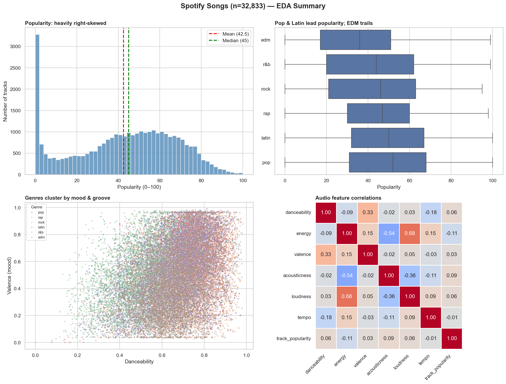

# Week 2 — Spotify Songs EDA

Exploratory Data Analysis on Spotify Songs dataset (~33k tracks).
Bagian dari [AI Engineer Journey](https://github.com/<username>/ai-engineer-journey).

## Goal

Eksplorasi karakteristik 6 genre musik di Spotify (EDM, Pop, Latin, R&B, Rap, Rock) 
dan menganalisis pola popularity, audio features, dan hubungan keduanya.

## Top Findings

1. **Most tracks are unpopular**: median popularity 45, with heavily right-skewed distribution
2. **Pop & Latin dominate popularity** despite EDM being the most energetic genre
3. **Audio features cluster predictably**: energy-loudness strongly positive (r=0.7), 
   energy-acousticness inverse (r=-0.6)
4. **No single sound formula for popularity**: audio features alone correlate weakly with popularity
5. **Each genre has distinct audio DNA**: rap most danceable, rock least danceable, 
   R&B most acoustic, Latin most cheerful

## Visualizations



[See full EDA notebook →](./notebooks/04_spotify_eda.ipynb)

## Tech Stack

- **Python 3.12** + **uv** (package management)
- **Pandas, NumPy** (data manipulation)
- **Matplotlib, Seaborn** (visualization)
- **Jupyter** (interactive analysis)

## Setup

```bash
uv sync
uv run jupyter notebook
```

Open `notebooks/04_spotify_eda.ipynb`.

## What I Learned

- NumPy fundamentals: vectorization, broadcasting, axis operations
- Pandas: filtering, groupby, agg, unstack, method chaining
- Data viz: histogram, boxplot, scatter, heatmap with seaborn
- EDA discipline: question → analysis → insight, not just plotting
- Data quality assessment: detect, decide, document

## Dataset

[Spotify Songs (TidyTuesday 2020-01-21)](https://github.com/rfordatascience/tidytuesday/tree/master/data/2020/2020-01-21)